# ERD eMadrasah

Dokumen ini disusun dari migration dan model Eloquent per 2026-08-28. Diagram menggunakan Mermaid ERD dan dapat dirender di GitHub/GitLab/Markdown viewer yang mendukung Mermaid.

## Diagram Utama

```mermaid
erDiagram
    users ||--o| gurus : "user_id"
    users ||--o{ tasks : "created_by"
    users ||--o{ tasks : "assigned_to"
    users ||--o{ task_logs : "user_id"
    users ||--o{ raport_nilai : "updated_by"

    tahun_pelajaran ||--o{ siswa : "tahun_pelajaran_id"
    tahun_pelajaran ||--o{ beban_mengajar : "tahun_pelajaran_id"
    tahun_pelajaran ||--o{ raport_nilai : "tahun_pelajaran_id"
    tahun_pelajaran ||--o{ raport_ekskul : "tahun_pelajaran_id"
    tahun_pelajaran ||--o{ raport_kehadiran : "tahun_pelajaran_id"
    tahun_pelajaran ||--o{ raport_kelulusan : "tahun_pelajaran_id"
    tahun_pelajaran ||--o{ raport_p5ppra : "tahun_pelajaran_id"
    tahun_pelajaran ||--o{ raport_prestasi : "tahun_pelajaran_id"
    tahun_pelajaran ||--o{ arsip_akademik : "tahun_pelajaran_id"

    gurus ||--o{ kelas : "guru_pembimbing_id"
    gurus ||--o{ jadwals : "guru_id"
    gurus ||--o{ agenda_guru : "guru_id"
    gurus ||--o{ guru_pengganti : "guru_pengganti_id"
    gurus ||--o{ guru_kelas : "guru_id"
    gurus ||--o{ beban_mengajar : "guru_id"

    kelas ||--o{ siswa : "kelas_id"
    kelas ||--o{ jadwals : "kelas_id"
    kelas ||--o{ guru_kelas : "kelas_id"
    kelas ||--o{ beban_mengajar : "kelas_id"
    kelas ||--o{ arsip_akademik : "kelas_id"

    mapels ||--o{ mapels : "parent_id"
    mapels ||--o{ jadwals : "mapel_id"
    mapels ||--o{ beban_mengajar : "mapel_id"
    mapels ||--o{ raport_nilai : "mapel_id"

    jam_pelajaran ||--o{ jadwals : "jam_pelajaran_id"
    jam_pelajaran ||--o{ guru_pengganti : "jam_pelajaran_id"

    agenda_guru ||--o{ guru_pengganti : "agenda_guru_id"

    siswa ||--o| orang_tua_wali : "siswa_id"
    siswa ||--o| perkembangan_siswa : "siswa_id"
    siswa ||--o{ siswa_dokumen : "siswa_id"
    siswa ||--o{ raport_nilai : "siswa_id"
    siswa ||--o{ raport_ekskul : "siswa_id"
    siswa ||--o{ raport_kehadiran : "siswa_id"
    siswa ||--o| raport_kelulusan : "siswa_id"
    siswa ||--o{ raport_p5ppra : "siswa_id"
    siswa ||--o{ raport_prestasi : "siswa_id"

    raport_p5ppra ||--o{ raport_p5ppra_detail : "p5ppra_id"

    kategori_sarana ||--o{ sarana_prasarana : "kategori_id"
    sarana_prasarana ||--o{ peminjaman_sarana : "sarana_id"
    sarana_prasarana ||--o{ pemeliharaan_sarana : "sarana_id"

    tasks ||--o{ task_logs : "task_id"
```

## Entitas Inti

### Identitas dan Akses

- `users`: akun aplikasi, role, status aktif, kontak, password.
- `gurus`: profil guru, bisa terhubung ke `users`.

### Master Akademik

- `tahun_pelajaran`: periode akademik dan penanda aktif.
- `kelas`: kelas/rombongan belajar, wali/guru pembimbing, ruangan, kapasitas.
- `mapels`: mata pelajaran, mendukung hierarki parent-child.
- `jam_pelajaran`: slot jam per hari dan sesi.
- `jadwals`: jadwal kelas-mapel-guru-slot.

### Guru dan Absensi

- `agenda_guru`: status kehadiran harian guru.
- `guru_pengganti`: guru pengganti pada slot jam tertentu.
- `guru_kelas`: relasi many-to-many guru dan kelas.
- `beban_mengajar`: alokasi jam mengajar guru per tahun pelajaran, mapel, dan kelas.

### Siswa dan Buku Induk

- `siswa`: biodata utama, kelas, status, identitas nasional/madrasah, alamat, kesehatan, hobi.
- `orang_tua_wali`: data ayah, ibu, wali.
- `perkembangan_siswa`: asal sekolah, data masuk, data keluar/lulus.
- `siswa_dokumen`: lampiran dokumen siswa.

### Raport

- `raport_nilai`: nilai akademik per siswa, tahun pelajaran, semester, dan mapel.
- `raport_ekskul`: nilai/keterangan ekstrakurikuler.
- `raport_kehadiran`: rekap sakit, izin, tanpa keterangan.
- `raport_kelulusan`: data kelulusan dan ijazah.
- `raport_p5ppra`: header projek P5/PPRA.
- `raport_p5ppra_detail`: target pencapaian per dimensi/elemen.
- `raport_prestasi`: catatan prestasi siswa.

### Administrasi

- `surat_masuk`: agenda surat masuk.
- `surat_keluar`: surat keluar.
- `template_surat`: template konten surat.
- `arsip_akademik`: file arsip akademik per tahun pelajaran, kelas, semester.
- `tasks`: tugas internal.
- `task_logs`: log aktivitas tugas.

### Sarana Prasarana

- `kategori_sarana`: kategori aset.
- `sarana_prasarana`: inventaris aset.
- `peminjaman_sarana`: riwayat peminjaman aset.
- `pemeliharaan_sarana`: riwayat pemeliharaan aset.

## Catatan Relasi

- Relasi dalam diagram menggabungkan FK eksplisit di migration dan relasi implisit yang sudah didefinisikan pada model Eloquent.
- Tabel raport memiliki beberapa relasi Eloquent yang belum semuanya diperkuat FK database.
- `jadwals.tahun_pelajaran_kode` memakai kode string, bukan `tahun_pelajaran_id`, sehingga tidak tergambar sebagai FK langsung.
- `mapels.parent_id` adalah relasi self-reference, tetapi belum dideklarasikan sebagai FK di migration.
- `gurus.user_id` diindeks dan dipakai di model, tetapi belum dideklarasikan sebagai FK di migration.

## Saran Penyempurnaan Skema

- Tambahkan FK untuk `gurus.user_id`, `mapels.parent_id`, dan seluruh relasi raport.
- Pertimbangkan mengganti `jadwals.tahun_pelajaran_kode` menjadi `tahun_pelajaran_id`.
- Tambahkan unique constraint untuk mencegah jadwal ganda pada slot kelas/hari/jam/tahun/semester.
- Tambahkan soft delete pada entitas arsip penting seperti siswa, guru, surat, raport, dan sarana.
- Tambahkan indeks pencarian pada `siswa.nama_lengkap`, `siswa.nis`, `siswa.nisn`, `surat_masuk.nomor_agenda`, `surat_keluar.nomor_surat`, dan `tasks.status`.
